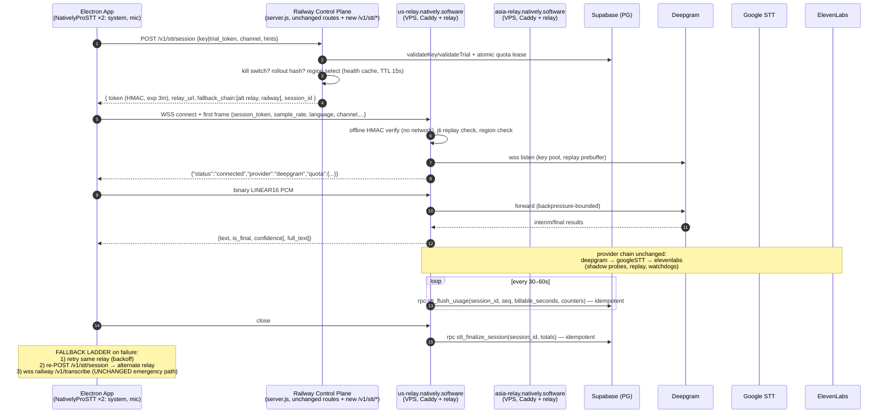
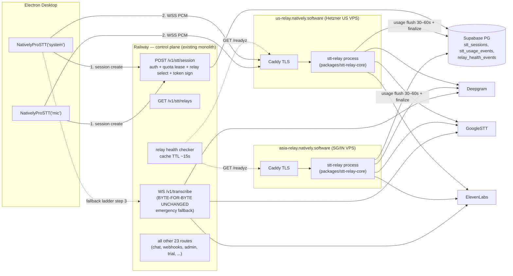

# Target STT Relay Architecture — Regional Relays + Railway Control Plane

**Date:** 2026-06-13
**Status:** Design (binding for implementation phases 2–13)
**Inputs (binding):**
- `docs/00-current-server-audit.md` — current-state audit (all `server.js:NNNN` line refs herein are against commit `6b61623`)
- `docs/00b-pre-migration-review-findings.md` — MUST-PRESERVE client contract (§1–12) + MUST-FIX list (F1–F15)

**One-sentence summary:** Move the realtime WS audio relay (`/v1/transcribe`) off Railway onto two cheap flat-bandwidth regional VPS relays (`us-relay` / `asia-relay`), keep Railway as the control plane that authenticates, reserves quota, selects a relay, and signs a short-lived HMAC session token the relay verifies offline; billing becomes durable via periodic idempotent flushes to Supabase; the existing Railway `/v1/transcribe` stays byte-for-byte untouched as the emergency fallback until 100% rollout + soak.

---

## 1. Final architecture

### 1.1 Mermaid





### 1.2 ASCII (single picture)

```
┌──────────────────────────── Electron Desktop ────────────────────────────┐
│  NativelyProSTT('system') ─┐         feature flags:                      │
│  NativelyProSTT('mic')   ──┤         regional_stt_relay_enabled/percent  │
└────────────────────────────┼──────────────────────────────────────────────┘
                             │ (1) POST /v1/stt/session  {key|trial_token, channel}
                             ▼
        ┌────────────── Railway control plane (existing server.js) ─────────────┐
        │  NEW: POST /v1/stt/session   auth → atomic quota lease → rollout %    │
        │       GET  /v1/stt/relays    → region select (health cache TTL 15s)   │
        │       admin: /admin/stt/relays, /admin/stt/session/:id                │
        │  KILL SWITCH: STT_RELAY_KILL_SWITCH=1 ⇒ always return railway path    │
        │  UNCHANGED: WS /v1/transcribe  ◄── emergency fallback (step 3)        │
        │  UNCHANGED: chat/webhooks/trial/admin/email/AI pools                  │
        └───────┬───────────────────────────────────────────────────────────────┘
                │ (2) response: { token: HMAC(payload).sig  exp≈3min,
                │                 relay_url: wss://us-relay.natively.software/ws,
                │                 fallback_chain: [asia-relay, railway] }
                ▼
   ┌─ us-relay.natively.software ─┐      ┌─ asia-relay.natively.software ─┐
   │ Caddy (auto-TLS, DNS-only CF)│      │ Caddy (auto-TLS, DNS-only CF)  │
   │ stt-relay process:           │      │ (same binary, REGION=asia)     │
   │  • offline HMAC token verify │      └────────────────────────────────┘
   │  • jti replay cache          │
   │  • EXACT WS client contract  │── wss ─► Deepgram (6-key pool, cooldowns)
   │    (00b MUST-PRESERVE §1-12) │── gRPC ─► GoogleSTT chirp_2 (incremental)
   │  • 30s prebuffer + replay    │── wss ─► ElevenLabs scribe_v2 (flag-gated)
   │  • usage flush every 30-60s ─┼──────► Supabase  stt_usage_events (idempotent,
   │  • finalize on close ────────┼──────►            seq-keyed) + stt_sessions
   │  • /healthz /readyz /metrics │
   │  • graceful: stop-accept →   │
   │    close 1001 → flush → drain│
   └──────────────────────────────┘
   (3) PCM client→relay, transcripts relay→client — same JSON frames as today
```

### 1.3 Fallback ladder (authoritative)

1. **Same relay retry** — client reconnect/backoff against the relay it was assigned (existing `NativelyProSTT` backoff: base 1500ms, cap 30s, jitter ±20%). Token may have expired → step 2.
2. **Alternate relay** — client re-POSTs `/v1/stt/session`; control plane returns the next healthy relay (or Railway directly if both relays are unhealthy). The session-create response always carries the full `fallback_chain` so the client can also walk it without a re-POST when Railway itself is briefly unreachable.
3. **Railway `/v1/transcribe`** — the unchanged emergency path. The client retains the old direct code path behind it; auth is the legacy first-frame `{key|trial_token}` (no relay token needed). This path requires zero new server code and is the rollback target of the kill switch.

---

## 2. Control plane (Railway) responsibilities

All NEW routes live in the existing `server.js` process (no new deployment unit on Railway). They are control-plane-only: no audio ever flows through them.

### 2.1 `POST /v1/stt/session`

Request:

```json
{
  "key": "natively_sk_…",            // OR "trial_token": "natively_trial_…"
  "channel": "system",               // whitelist {system, mic, default}  (fixes F16)
  "sample_rate": 16000,              // hint; relay re-clamps anyway
  "audio_channels": 1,
  "language": "en-US",
  "app_version": "3.4.1",
  "platform": "darwin",
  "latency_probes": { "us": 42, "asia": 187 }   // optional, ms; client-measured
}
```

Behavior (in order):

1. `checkDDoS(ip)` + the existing 120/min rate limiter (reuse `server.js:1470-1486`, `:213-239`).
2. **Auth** — reuse `validateKey` (`server.js:2030-2106`) / `validateTrial` (`:1778-1805`) verbatim. Same caches, same `maybeResetQuota`.
3. **Quota validation at session create** — `quota.transcription.remaining <= 0` → HTTP `402 {"error":"transcription_quota_exceeded","resets_at":…}` (same string the WS path uses, MUST-PRESERVE §4). Additionally take an **atomic quota lease** (fixes F7): RPC `stt_reserve_session(key_id|trial_id, channel)` inserts the `stt_sessions` row with status `reserved` and returns `quota_remaining_seconds` computed inside the DB transaction — concurrent session-creates each see the post-reservation remainder instead of a 30s-stale cache.
4. **Kill switch / rollout gate** — `STT_RELAY_KILL_SWITCH=1` or `hash(user) % 100 >= STT_RELAY_ENABLE_PERCENT` ⇒ respond with `{ "mode": "railway" }` and the client uses the legacy path. (§8 pseudocode.)
5. **Region selection** — §8 algorithm against the relay health cache.
6. **Token signing** — §7. Claims include the quota snapshot from step 3.
7. Respond:

```json
{
  "mode": "relay",
  "session_id": "st_01HV…",
  "token": "eyJ2IjoxLCJqdGkiOi…0.k3jX9…",
  "relay_url": "wss://us-relay.natively.software/ws",
  "region": "us",
  "expires_at": "2026-06-13T10:03:00Z",
  "fallback_chain": [
    { "mode": "relay", "relay_url": "wss://asia-relay.natively.software/ws", "region": "asia" },
    { "mode": "railway", "relay_url": "wss://api.natively.software/v1/transcribe" }
  ],
  "quota": { "used": 1200, "limit": 30000, "remaining": 28800 }
}
```

Status codes: `200` issued; `402` quota exceeded (with `resets_at`); `401` bad key/trial (same error strings as `validateKey`: `key_not_found`, `subscription_inactive`, `account_suspended`, `trial_expired`, `trial_not_found`); `403` `ip_blocked`; `429` rate limited; `503` both relays down AND railway WS at capacity (client then walks its cached fallback chain anyway).

### 2.2 `GET /v1/stt/relays`

Auth: API key or trial token. Returns the health-cache view: `[{relay_id, region, url, healthy, last_check_ms, rtt_ms}]`. Used by the client to pre-probe latency (optional) and by support/debugging. Never returns relay secrets.

### 2.3 Relay health cache

- Active checker: every `STT_RELAY_HEALTH_CACHE_MS` (default **15 000 ms**) GET `https://<relay>/readyz` with timeout `STT_RELAY_HEALTH_TIMEOUT_MS` (default **2 000 ms**). 2 consecutive failures ⇒ unhealthy; 1 success ⇒ healthy (fast recovery, slow trip).
- Passive signal: if clients re-POST `/v1/stt/session` with `failed_relay_id` in the body (set by the client on ladder step 2), count it; ≥N failures within the cache window force-marks that relay unhealthy immediately without waiting for the next active probe.
- Cache is in-memory on Railway (single instance today — acceptable, audit §9.1; the cache is advisory only, correctness never depends on it).

### 2.4 Env flags (Railway side)

| Var | Default | Meaning |
|---|---|---|
| `STT_RELAY_KILL_SWITCH` | `0` | `1` ⇒ `/v1/stt/session` always answers `mode:"railway"`; instant rollback, no deploy |
| `STT_RELAY_ENABLE_PERCENT` | `0` | deterministic rollout percent (§8) |
| `STT_RELAY_US_URL` / `STT_RELAY_ASIA_URL` | — | relay base URLs |
| `STT_RELAY_DEFAULT_REGION` | `us` | unknown-geo default |
| `STT_RELAY_FORCE_REGION` | unset | dogfood: force all relay-mode sessions to one region |
| `STT_RELAY_ALLOWLIST` | unset | comma-sep key-id/trial-id list that bypasses percent gate (internal dogfood) |
| `STT_SESSION_TOKEN_SECRET` | — | HMAC secret (shared with relays); **boot-fails in prod if unset**, same pattern as `TRIAL_JWT_SECRET` (`server.js:1707-1714`) |
| `STT_SESSION_TOKEN_TTL_S` | `180` | token exp (clamped 120–300) |
| `STT_RELAY_HEALTH_TIMEOUT_MS` / `STT_RELAY_HEALTH_CACHE_MS` | `2000` / `15000` | health checker tuning |

### 2.5 Admin inspection routes

- `GET /admin/stt/relays` (x-admin-secret) — full health cache + last N health transitions + current rollout/kill-switch values.
- `GET /admin/stt/session/:session_id` — joins `stt_sessions` + latest `stt_usage_events` row; replaces grepping logs to debug a user's session.
- Existing `/admin/fail-provider` / `/admin/reset-provider` (`server.js:7318-7343`) remain Railway-local; relays get their own equivalent via an admin-token-gated `POST /admin/provider` on each relay (used by integration tests only).

---

## 3. Regional relay responsibilities

One Node 20+ process per VPS (systemd unit), fronted by Caddy for TLS. Stateless except for in-flight session state; all durable state in Supabase.

### 3.1 Session admission

- WS endpoint `wss://<relay>/ws`. First frame within 5s (same `auth_timeout` semantics, MUST-PRESERVE §10) is JSON:

```json
{ "session_token": "<HMAC token>", "sample_rate": 16000, "language": "en-US",
  "language_alternates": [], "audio_channels": 1, "channel": "system" }
```

- **Offline HMAC verify** (§7): no network call, no Supabase read on the hot path. Bad/expired/wrong-region/replayed token ⇒ `{"error":"auth_required"}` (or `invalid_key_format` analog: `invalid_session_token`) + close. NOTE: `invalid_session_token` is a NEW error string — the relay-aware client treats it as "re-POST /v1/stt/session" (token likely expired), never fatal. All legacy error strings keep their exact meaning.
- The token's `channel` claim must match the frame's `channel`; `sample_rate`/`audio_channels` are clamped to the token's `max_sample_rate`/`max_channels`.
- jti replay cache (per relay, in-memory, TTL = token exp window) rejects token reuse — one WS per token; reconnects get a fresh token via session re-create (the control plane reuses the same `session_id` row and bumps `reconnect_count` when the prior token's `session_id` matches and the session isn't finalized).

### 3.2 Exact WS client contract preservation

The relay reimplements `/v1/transcribe` behavior using the shared core (§4). **Binding:** 00b MUST-PRESERVE §1–12, verbatim:

1. (§1) Auth handshake shape: first JSON frame, then raw binary LINEAR16 PCM; `language:'auto'` enables auto-detect. (The relay accepts `session_token` instead of `key`/`trial_token`; everything else identical. The legacy fields are *also* accepted and rejected with `auth_required` + a hint, so a misrouted legacy client fails loud and fast.)
2. (§2) Transcript JSON shape: interim `{text, is_final:false, confidence}`; final `{text, full_text:<cumulative finals>, is_final:true, confidence}`; `full_text` omitted on interims.
3. (§3) Status vocabulary: `{status:'connected', provider, quota}` (gates the client's buffer flush), `{status:'provider_switched', from, to, reason, has_replay}`, `{language_detected:<bcp47>}` at most once/session.
4. (§4) Error vocabulary — exact strings: `auth_timeout`, `auth_must_be_json`, `invalid_key_format`, `auth_required`, `trial_expired`, `trial_not_found`, `trial_ended`, `key_not_found`, `subscription_inactive`, `account_suspended`, `transcription_quota_exceeded` (+`resets_at`), `all_stt_providers_down` (+`reason`), `chunk_too_large`, `session_byte_budget_exceeded`, `ip_blocked`, `invalid_trial_token`. Client-fatal set unchanged.
5. (§5) Close codes: 1001 `server_restart`, 1008 too-many-connections/quota cutoff, 1013 at-capacity, 1009 auth-queue overflow.
6. (§6) Reconnect takeover per `identity:channel` within a relay; old socket's close must not wipe the new session's map entries (port the `liveSockets` guard, `server.js:6032-6040`). Cross-relay takeover is prevented by routing: both channels + reconnects of one identity pin to one region (§8), and the control plane refuses to issue a token for a different region while a non-finalized session exists for that `identity:channel` unless the prior relay is unhealthy.
7. (§7) Billing semantics: system + `default` bill; mic free when overlapping a billed system session (NEW mechanism, same semantics — §6.5); <30s with no tracked speech free; paid `max(1, round(seconds/60))` minutes; trial exact seconds vs 600s cap; Deepgram bills `p.duration` finals; fallback bills wall-clock incl. flap windows (C6) with pre-failover wall-clock substitute (P2-4).
8. (§8) Mid-session quota watchdog: 25s estimator vs the **token's** `quota_remaining_seconds` budget; cut with `transcription_quota_exceeded` + close 1008.
9. (§9) Replay/prebuffer: 30s `CircularBuffer`, full replay on failover, downtime-sized replay on reconnect, pre-auth chunk queue ≤200 drained into prebuffer (P0-1), EL `session_started` gap flush (C1).
10. (§10) Keep-alives: 25s client ping, Deepgram `KeepAlive` JSON at ≥5s idle, EL real-silence chunks at 10s idle, 5s auth timeout.
11. (§11) Provider chain + error classification: deepgram→googleSTT→elevenlabs forward-only; Deepgram HTTP-status classes (400 = failover w/o pool strike, 401/403 = rotate, 402 = disable till midnight UTC); close-code taxonomy (1011 probe/fast-reconnect, late-1006 idle same-key, 1000-idle silent reconnect); multi-identity strike gating with channel-suffix strip (`server.js:890-971`) ported exactly — it prevented a real global outage.
12. (§12) Input clamps: sample_rate 8000–48000, channels 1–2, language regex, 64KB frame cap, per-session byte budget, per-IP + global ceilings (per-relay values, §11).

### 3.3 Metering + durable usage flush (fixes F5, F6)

- In-memory accumulators identical to today (`secondsUsed`, `fallbackSecsAccumulated`, byte/chunk counters) PLUS a monotonically increasing `seq`.
- Every `STT_USAGE_FLUSH_MS` (default 30 000, env-tunable 30–60s) per live session: RPC `stt_flush_usage(session_id, seq, snapshot…)` — idempotent upsert keyed `(session_id, seq)`; the `stt_sessions` row is updated with the running totals only when `seq` is greater than the last applied (monotonic guard). Flush failures increment a metric + alert; they never affect the audio path.
- Crash loss window shrinks from "entire session (≤4h)" to ≤60s per session.

### 3.4 Finalize on close

`socket.on('close')` → compute final seconds exactly as today (§3.2 item 7) → RPC `stt_finalize_session(session_id, totals…)` which (a) writes the terminal `stt_sessions` row (status, close_code, totals), (b) applies the **delta** between final billable amount and what checkpoints already applied to `api_keys.transcription_minutes_used` / `free_trials.stt_seconds_used`, atomically and idempotently (re-running finalize is a no-op). Cache eviction semantics preserved by the control plane re-reading on next auth (relay holds no key cache requiring webhook invalidation — audit §10.4 concern dissolved).

### 3.5 Graceful shutdown

systemd `ExecStop` → SIGTERM → relay: (1) `/readyz` flips 503 (Railway health cache stops routing new sessions within ≤15s; relay also refuses new WS upgrades immediately), (2) send close **1001 `server_restart`** to all clients (they reconnect via the ladder and land on the healthy relay), (3) flush all sessions' usage + finalize, (4) drain up to `STT_RELAY_DRAIN_MS` (default 20 000, matching today's contract), (5) exit. `TimeoutStopSec=30`.

### 3.6 Local endpoints

- `GET /healthz` — process liveness (event loop responsive). Always 200 if up.
- `GET /readyz` — 200 only if: ≥1 Deepgram key not cooling AND Supabase reachable (cached ≤30s) AND live session count < capacity watermark AND not draining.
- `GET /metrics` — Prometheus text format (§12).
- `POST /admin/provider` — admin-token gated test hook (force-fail/reset provider slots), parity with Railway's `/admin/fail-provider`.

---

## 4. Shared core — `packages/stt-relay-core`

New workspace package; **extraction is verbatim-first** (audit §9.9: the close-code taxonomy and deny-lists are production-log forensics — do not rewrite). Both the relay binary and (later, optionally) Railway's own `/v1/transcribe` can consume it, but Railway's copy is NOT switched until after 100% rollout + soak (migration invariant, §16).

| Module | Extracted from `server.js` (audit §10.2) | Notes / MUST-FIX applied |
|---|---|---|
| `net/wsAgent.ts` — WS DNS cache + keep-alive `https.Agent` | `76-113` | as-is |
| `providers/deepgram/keyPool.ts` — pool, per-key strike/cooldown | `517-575` | as-is (`pickDeepgramKey`, `markDeepgramKeyFailed/Healthy`) |
| `providers/deepgram/reconnectSpreader.ts` | `577-592` | per-relay-node global counter is fine |
| `providers/deepgram/modelLangRouter.ts` (incl. `NOVA_2_ONLY_LANGS`, en-* normalization) | `594-632` | verbatim — encodes prod-verified 400 behavior |
| `providers/elevenlabs/keyPool.ts` | `634-679` | as-is |
| `providers/elevenlabs/client.ts` — base64 JSON sender, `session_started` gate, gap flush, silence keepalive, error taxonomy, 1000-cap reconnect | `5457-5755`, `4311-4312` | gated behind `ENABLE_ELEVENLABS_FALLBACK` (§11) |
| `lang/autoDetect.ts` — `AUTO_DETECT_LANGS`, `normaliseDetectedLang`, `CHIRP2_LANG_MAP`, `toChirp2Lang` | `763-798` | as-is |
| `config/timing.ts` — watchdog/probe constants, env-overridable | `800-805` | keep `TEST_*` overrides so the existing integration suites can be retargeted (audit §11) |
| `health/providerHealth.ts` — STT slots of `markFailed`/`markHealthy`, multi-identity strike gating, `msUntilMidnight` | `807-825`, `884-978` | STT slots only; embedding slots stay on Railway |
| `buffers/circularBuffer.ts` | `980-1040` | as-is (prebuffer + Google ring) |
| `audio/pcmRms.ts` | `1042-1055` | as-is |
| `providers/google/rollingSession.ts` | `1057-1291` | **F4 fix here**: replace 8s-window/500ms-roll re-send with incremental-suffix submission (send only unsent bytes per recognize call, keep the RMS gate, stability-based finals, commitEpoch). Flag `GOOGLE_INCREMENTAL=1` default on relay; old behavior retained behind flag for A/B conformance tests |
| `providers/picker.ts` — `hasAvailable*Key`, `pickSTTProvider`, `pickNextSTTProvider` | `3428-3463` | as-is |
| `session/replay.ts` — replay helpers (full / short / downtime-sized) | `4407-4436` | **F11 fix**: billed-through cursor so replayed ranges never double-count `p.duration`; dedupe duplicate finals after replay |
| `session/shadowProbes.ts` — Google + EL probes + teardown | `4438-4731` | **F13 fix**: `switchToFallback` tears down in-flight probes first |
| `session/failover.ts` — `switchToFallback` | `4733-4806` | C6 flap accumulation preserved |
| `session/connectProvider.ts` — `connectSTTProvider` (Deepgram/Google/EL arms) | `4808-5756` | largest unit; **F17 fix**: `authed` guard in connect-timeout body; **F10 fix**: check `bufferedAmount` on provider sockets, shed (drop oldest non-final audio) past `PROVIDER_BACKPRESSURE_BYTES` |
| `session/chunkPath.ts` — auth timeout + `processChunk` | `5758-5842` | 64KB cap, byte budget, RMS gate, drop counters preserved |
| `session/authHandshake.ts` — frame parse → session init | `5844-6006` | swaps `validateKey/validateTrial` for offline token verify; pre-auth queue ≤200 (P0-1) preserved; **F16 fix**: whitelist `channel` |
| `session/closeBilling.ts` — close/billing/error handlers | `6008-6138` | billing math verbatim; sink swapped to flush/finalize RPCs; **F12 fix**: map cleanup on every rejection path |
| `session/transcriptSender.ts` — backpressure interim-drop | `4357-4363` | as-is |
| `session/quotaWatchdog.ts` — live-billable estimator + 25s ping loop | `4365-4401` | budget source = token claim (F7) |
| `auth/tokenVerify.ts` — HMAC verify + jti cache | NEW | §7 |
| `billing/usageFlush.ts` — periodic idempotent flush + finalize | NEW | §3.3–3.4, F5/F6 |
| `billing/types.ts` — metering/billing counter types | NEW (audit §10.6: none exist to extract) | shared with control plane admin routes |
| `obs/logging.ts` — safe logging, `hashIP`, session-id derivation | `1559-1609` | **F1 fix**: session ids = `st_<ulid>`, never raw keys; **F9 fix**: transcript text only at debug, IPs hashed |
| `obs/metrics.ts` — Prometheus counters/histograms | NEW | §12 |
| `net/ipTrust.ts` — `getIP`/`normalizeIPForLimit` with config-driven trusted-header order | `1565-1609` | **F8 fix**: `TRUSTED_PROXY_HEADER` env (Caddy sets `X-Forwarded-For`; Envoy header trust is Railway-only config) |
| `ops/housekeeping.ts` — STT subset of the 60s sweep | `1293-1366` subset | webhook purge + Groq/Tavily evictions stay on Railway |
| `ops/registries.ts` — `activeSessions`, `liveSockets`, `wsConnections`, caps | `241-271` | `recentSystemChannels` is NOT ported — replaced by DB overlap pairing (§6.5, F2/F3) |
| `ops/ddos.ts` — `checkDDoS` + maps | `757-761`, `1469-1486` | per-relay instance |
| `obs/tgAlert.ts` — debounced Telegram alerting | `1488-1556` | kept (familiar ops channel) + mirrored to Axiom |

---

## 5. Client changes — `electron/audio/NativelyProSTT.ts`

Minimal, flag-gated; the legacy direct path is preserved untouched as both the flag-off path and ladder step 3.

1. **Session create**: when `regional_stt_relay_enabled`, before opening WS, `POST https://api.natively.software/v1/stt/session` with key/trial token + channel + optional latency probes. Response cached per channel until `expires_at`.
2. **Relay connect**: open WSS to `relay_url`; first frame sends `session_token` instead of `key`/`trial_token` — all other first-frame fields (`sample_rate`, `language`, `language_alternates`, `audio_channels`, `channel`) unchanged (the 16k-mono canonical rate from the Rust DSP already makes the client a good citizen). Everything downstream of `status:'connected'` — buffer flush, transcript handling, language-detect reconnect, fatal-error list — is untouched.
3. **Fallback ladder** (§1.3): on relay connect failure / `invalid_session_token` / mid-session relay death (close ≠ deliberate): retry same relay ≤2 with existing backoff → re-POST `/v1/stt/session` (sends `failed_relay_id`) → next entry in cached `fallback_chain` → Railway legacy path. Once on Railway, stay there for the rest of the meeting (no flap-back; next meeting re-evaluates).
4. **Feature flags** (settings-backed + env override, mirroring the 3-places gotcha):
   - `regional_stt_relay_enabled` (master, default false until rollout)
   - `regional_stt_relay_percent` (client respects server decision; this only gates whether the client even calls session-create)
   - `regional_stt_force_region` (`us`|`asia`, dogfood)
   - `regional_stt_railway_fallback` (default true; safety hatch to disable ladder step 3 only for testing relay isolation)
5. **Telemetry**: PostHog events `stt_relay_selected {region, mode}`, `stt_relay_connected {region, ms}`, `stt_relay_failed {region, stage, code}`, `stt_fallback_used {from, to}`, `stt_first_transcript_bucket {<1s,1-2s,2-5s,>5s}`. Sentry breadcrumbs on ladder transitions; no transcript text, no raw keys.
6. **Unchanged**: `dnsHelpers.ts` IPv4-only resolver is re-validated against relay hosts (both Hetzner and Vultr/DO publish A records; fine), reconnect/backoff constants, buffer-overflow semantics (≤500 chunks), 25s ping.

---

## 6. Supabase schema (new migration `natively-api/migrations/003_stt_relay_sessions.sql`)

> Pre-req (audit §10.5 / F6): export the live `increment_transcription_minutes` definition into the repo as part of migration 003 before anything else lands.

### 6.1 `stt_sessions` — one row per session (created by control plane at reserve, updated by relay flushes, terminal at finalize)

```sql
create table stt_sessions (
  session_id           text primary key,            -- 'st_' || ulid
  user_id              uuid references api_keys(id),
  trial_id             uuid references free_trials(id),
  auth_type            text not null check (auth_type in ('key','trial')),
  plan                 text,                        -- standard|pro|max|ultra|trial
  relay_id             text,                        -- 'us-1' | 'asia-1' | 'railway'
  region               text,                        -- 'us' | 'asia' | 'railway'
  channel              text not null check (channel in ('system','mic','default')),
  started_at           timestamptz,                 -- first WS open on relay
  ended_at             timestamptz,
  status               text not null default 'reserved'
                       check (status in ('reserved','active','finalized','expired','abandoned')),
  provider_primary     text,                        -- first connected provider
  provider_final       text,                        -- provider at close
  duration_seconds     integer not null default 0,  -- wall clock
  billable_seconds     integer not null default 0,
  bytes_in_from_client bigint  not null default 0,
  bytes_out_to_deepgram bigint not null default 0,
  bytes_out_to_google_stt bigint not null default 0,
  bytes_out_to_elevenlabs bigint not null default 0,
  bytes_out_to_client  bigint  not null default 0,
  chunks_received      integer not null default 0,
  chunks_forwarded     integer not null default 0,
  chunks_dropped       integer not null default 0,
  reconnect_count      integer not null default 0,
  failover_count       integer not null default 0,
  shadow_probe_count   integer not null default 0,
  first_transcript_ms  integer,
  final_transcript_count integer not null default 0,
  close_code           integer,
  close_reason         text,
  error_code           text,
  created_at           timestamptz not null default now(),
  updated_at           timestamptz not null default now()
);
create index stt_sessions_identity_overlap
  on stt_sessions (coalesce(user_id, trial_id), channel, started_at, ended_at);
create index stt_sessions_status on stt_sessions (status) where status in ('reserved','active');
```

### 6.2 `stt_usage_events` — append-only checkpoint journal

```sql
create table stt_usage_events (
  session_id        text not null references stt_sessions(session_id),
  seq               integer not null,              -- monotonic per session
  billable_seconds  integer not null,              -- cumulative snapshot, not delta
  duration_seconds  integer not null,
  bytes_in          bigint  not null,
  provider          text,
  recorded_at       timestamptz not null default now(),
  primary key (session_id, seq)                    -- idempotency key
);
```

### 6.3 RPCs (all `security definer`, migration-managed)

- `stt_reserve_session(...) returns (session_id, quota_remaining_seconds)` — inserts `reserved` row; computes remaining = plan limit − used − sum(active sessions' flushed billable) atomically (**F7 lease**).
- `stt_flush_usage(p_session_id, p_seq, p_snapshot jsonb)` — `insert … on conflict (session_id, seq) do nothing`; updates `stt_sessions` running totals only if `p_seq >` last applied seq (idempotent, replay-safe — **F5/F6**).
- `stt_finalize_session(p_session_id, p_totals jsonb)` — idempotent: if status already `finalized`, no-op return. Else set terminal fields, compute `delta = final_billable − already_checkpointed_billable`, apply delta to `api_keys.transcription_minutes_used` (minute math at the *session* level: `max(1, round(total_seconds/60))` minus minutes already attributed) or `free_trials.stt_seconds_used` capped at 600 — **F6** (capped, idempotent, in-repo).
- `stt_mic_overlap_billed(p_identity, p_started timestamptz, p_ended timestamptz) returns boolean` — §6.5.
- Reaper (pg_cron or Railway housekeeping): `reserved` rows older than 10 min → `expired`; `active` rows with no flush for 5 min → `abandoned` + finalize from last checkpoint (covers relay SIGKILL — at most 60s of usage lost, **F5**).

### 6.4 `relay_health_events`

```sql
create table relay_health_events (
  id bigint generated always as identity primary key,
  relay_id text not null, region text not null,
  healthy boolean not null, rtt_ms integer, detail text,
  observed_at timestamptz not null default now()
);
```

Written by the Railway health checker on every state *transition* (not every probe). Powers the admin routes + "railway-fallback %" alerting.

### 6.5 How this fixes the findings

- **F2 (pairing race / double-bill)**: mic billing no longer depends on the in-memory `recentSystemChannels` snapshot taken at auth. At mic-session finalize, `stt_mic_overlap_billed(identity, mic.started_at, mic.ended_at)` runs a DB overlap query: does a billed `system`/`default` session for the same identity overlap ≥50% of the mic session's wall-clock (`tstzrange &&` + intersection length)? Overlap ⇒ mic free. Works across relay instances and survives close-ordering (system closing first is fine — its row has `ended_at` + `billable_seconds` already).
- **F3 (heartbeat bypass)**: the overlap query requires the system session to be *billed* (`billable_seconds > 0`) and the overlap to cover the mic session's duration — a <30s free heartbeat system session no longer launders a 2h mic stream.
- **F5 (bill-only-at-close)**: 30–60s checkpoints via `stt_usage_events`; reaper finalizes abandoned sessions from the last checkpoint.
- **F6 (silent/non-idempotent/unversioned writes)**: every RPC in repo migration 003; flushes idempotent on `(session_id, seq)`; finalize idempotent on status; trial cap enforced in-RPC; flush failures alert (metric + Telegram), never silent.
- **F7 (quota TOCTOU)**: `stt_reserve_session` computes remaining inside the transaction including other active sessions' checkpointed usage; the snapshot rides in the token; the relay's 25s watchdog enforces it mid-session; finalize reconciles exact usage. Concurrent sessions can still overrun by ≤ (watchdog granularity × N), bounded and small — same watchdog contract as today (MUST-PRESERVE §8) but against a non-stale budget.

---

## 7. Token security model

**Format**: compact HMAC — `base64url(json_payload) + "." + base64url(HMAC_SHA256(secret, base64url(json_payload)))`. Same construction as the existing trial token (`server.js:1716-1744`), which is already proven in production.

**Why not JWT**: (a) zero library dependency on the relay hot path (Node `crypto` only); (b) no `alg` header ⇒ no alg-confusion/`none` downgrade class of bugs; (c) verification is one HMAC + constant-time compare — trivially offline, no JWKS fetching, no clock-skew library behavior to audit; (d) we control both producer and consumer, so JWT interop buys nothing. Trade-off: no standard tooling to decode — acceptable, payload is plain base64url JSON.

**Claims**:

```json
{
  "v": 1,
  "jti": "01HV8…",                       // nonce for replay cache
  "session_id": "st_01HV…",
  "sub": "k_9f3a…",                       // key-id or hashed trial-id — NEVER the raw API key (F1)
  "auth_type": "key",                     // 'key' | 'trial'
  "plan": "pro",
  "channel": "system",
  "region": "us",
  "quota_remaining_seconds": 28800,        // atomic lease snapshot (F7)
  "allowed_providers": ["deepgram","googleSTT","elevenlabs"],
  "max_sample_rate": 16000,                // 48000 only if stereo/48k flag on (§11)
  "max_channels": 1,
  "allow_dual_stream": true,
  "app_version": "3.4.1",
  "platform": "darwin",
  "iat": 1781430000,
  "exp": 1781430180                        // TTL default 180s, env-tunable 120–300
}
```

**Properties**:

- **Secret**: `STT_SESSION_TOKEN_SECRET` from env on Railway (signer) and each relay (verifier). Never in the repo; provisioned via Railway env + VPS systemd `EnvironmentFile` (root-only, 0600). Rotation: relays accept `STT_SESSION_TOKEN_SECRET` + `STT_SESSION_TOKEN_SECRET_PREV` during a rotation window.
- **No provider keys in the token** — Deepgram/Google/EL keys live only in relay env; the token merely *authorizes* a session.
- **Kill switch interaction**: Railway stops issuing tokens (kill switch / percent=0) AND relays honor `RELAY_REFUSE_NEW=1` (refuse new WS upgrades, drain existing) — two independent off-switches.
- **Replay protection**: per-relay in-memory jti cache, TTL = token exp window (≤5 min ⇒ tiny). A token is single-use; the WS *connection* it admits can live for hours (session lifetime is governed by the session, not the token).
- **Wrong-region rejection**: relay compares the `region` claim to its own `RELAY_REGION`; mismatch ⇒ reject. Prevents a leaked token for us-relay being replayed against asia-relay, and keeps the §3.2-item-6 channel-pinning invariant enforceable.
- **Expiry only gates admission** — never kills a live session (the quota watchdog does that).

---

## 8. Region routing algorithm (control plane)

```pseudo
function selectRoute(authIdentity, req):
    if env.STT_RELAY_KILL_SWITCH == "1":
        return { mode: "railway" }

    # deterministic rollout — same user always gets same answer for a given percent
    bucket = fnv1a32(identityStableId(authIdentity)) % 100      # key-id or trial-id, NOT raw key
    if bucket >= int(env.STT_RELAY_ENABLE_PERCENT or 0) and not allowlisted(authIdentity):
        return { mode: "railway" }

    relays = healthCache.list()          # [{region, url, healthy, rtt}]

    # 0. session-affinity pin: an active/reserved non-finalized session for this
    #    identity (other channel, or reconnect) pins the region if that relay is healthy
    pinned = activeSessionRegion(authIdentity)
    if pinned and relays[pinned].healthy: region = pinned

    # 1. forced region (dogfood)
    else if env.STT_RELAY_FORCE_REGION and relays[env.STT_RELAY_FORCE_REGION].healthy:
        region = env.STT_RELAY_FORCE_REGION

    # 2. client latency probes (if provided and probing allowed)
    else if req.latency_probes:
        region = argmin over {r : relays[r].healthy} of req.latency_probes[r]

    # 3. geo map from request IP
    else:
        geo = geoLookup(req.ip)          # country-level, local mmdb, no external call
        region = case geo:
            US, CA, LatAm            -> "us"
            India, SE/E Asia, AU/NZ  -> "asia"
            EU, UK, MEA              -> "us"     # us-east transatlantic < asia for EU
            unknown                  -> env.STT_RELAY_DEFAULT_REGION  # "us"

    # 4. health overrides
    if not relays[region].healthy:
        alt = otherRegion(region)
        if relays[alt].healthy: region = alt
        else: return { mode: "railway" }          # both down ⇒ emergency path

    return {
        mode: "relay",
        region,
        relay_url: relays[region].url,
        fallback_chain: [ relayEntry(otherRegion(region)) if healthy,
                          railwayEntry() ]          # ALWAYS terminated by railway
    }
```

Notes:

- **Deterministic rollout** — `hash(identity) % 100 < STT_RELAY_ENABLE_PERCENT`: a user's experience is stable within a stage; raising the percent only ever *adds* users (monotonic buckets), so a 1%→10% bump doesn't reshuffle the original 1%.
- The response **always includes the full fallback chain ending in Railway**, so a client that loses contact with the control plane mid-meeting can still complete the ladder from cache.
- Geo lookup is a bundled MaxMind-style country db on Railway — no per-session external call, no latency added.

---

## 9. Relay health model

| Surface | Semantics | Checked by |
|---|---|---|
| `GET /healthz` | process up, event loop responsive (<250ms self-timer drift) | systemd watchdog, uptime monitors |
| `GET /readyz` | ready for NEW sessions: ≥1 non-cooling Deepgram key, Supabase reachable (cached probe ≤30s), live sessions < `RELAY_MAX_SESSIONS` watermark (default 200, per-relay), not draining | Railway health checker |
| `GET /metrics` | Prometheus scrape (§12) | Axiom/agent scrape |

Railway health checker: probe `/readyz` every `STT_RELAY_HEALTH_CACHE_MS` (15s) with `STT_RELAY_HEALTH_TIMEOUT_MS` (2s) timeout; 2 consecutive fails ⇒ unhealthy (writes `relay_health_events` transition row + Telegram alert), 1 success ⇒ healthy. Passive signal: client-reported `failed_relay_id` on session re-create counts toward immediate force-unhealthy (≥3 distinct identities within one cache window), because clients see WS-path failures the HTTP probe can miss (e.g., Caddy up, relay WS handler wedged).

Capacity note: `/readyz` flipping at the watermark naturally sheds *new* sessions to the other region while existing sessions continue — the global 1013 close becomes a rarity instead of the primary backstop.

---

## 10. Failover model

| Failure | Detection | Response |
|---|---|---|
| Relay unreachable at connect | client WS connect error/timeout | ladder: retry same ×2 → session re-create (alternate) → Railway |
| Mid-session relay death | WS close 1006/no pong | client re-POSTs `/v1/stt/session` (control plane health cache likely already marks it; gets healthy relay or Railway); new session row, `reconnect_count`++ on the identity; abandoned old session finalized from last checkpoint by the reaper |
| Relay drain/redeploy | close 1001 `server_restart` | client reconnects immediately (existing behavior); lands on other relay via session re-create |
| STT provider failure inside relay | unchanged from today | relay-side chain deepgram→googleSTT→elevenlabs with shadow probes, replay, spreader — IDENTICAL semantics (MUST-PRESERVE §11); client at most sees `provider_switched` |
| Control plane down | session-create fails | client uses cached `fallback_chain` → Railway legacy WS (auths with key/trial directly) |
| Both relays down | health cache / ladder exhaustion | session-create returns `mode:"railway"`; alert fires (§12) |
| Supabase down | flush/finalize failures | audio path unaffected (flushes are out-of-band); accumulators retained + retried with backoff; alert on >3 consecutive flush failures; finalize retried by reaper |

Provider-side failover (the hard-won part) is deliberately **not redesigned** — it moves as-is inside the shared core.

---

## 11. Cost guards

| Guard | Default | Mechanism |
|---|---|---|
| Canonical ingress format | 16 kHz mono | token claims `max_sample_rate:16000, max_channels:1` for all plans by default; relay clamps the auth frame to the token (the Electron DSP already emits canonical 16k mono — audit §6 — so this is a backstop, not a behavior change). Flags `STT_ALLOW_48K`, `STT_ALLOW_STEREO`, per-plan overrides, raise the claim (F14) |
| Dual-stream gate | allowed | `allow_dual_stream` claim; if a plan/abuse rule sets false, the second channel's session-create 402s |
| Max session length | 14 400 s (4 h) | relay wall-clock cutoff → close 1008 + finalize (same TTL as today's sweep) |
| Per-session byte budget | 2× declared-rate 4h stream | preserved verbatim (`server.js:5986-5990`); `session_byte_budget_exceeded` |
| Max reconnects/session | 30 | token reuse blocked by jti; session re-creates counted on `stt_sessions.reconnect_count`; excess ⇒ session-create 429 |
| Max replay seconds/session | 300 s cumulative | counter in relay; past cap, failover replays shrink to 5s windows (bounds F4-adjacent replay spend) |
| Per-IP / global WS caps | 5/IP (post-auth budget separate from handshake budget, F20), `RELAY_MAX_SESSIONS=200` per relay | per-relay; `/readyz` sheds at watermark before hard 1013 |
| Backpressure | client-side: drop interims >1MB `bufferedAmount` (preserved); provider-side: cap `bufferedAmount` per provider socket, shed oldest non-final audio + count (F10) |
| Google amplification | incremental-suffix submission | F4 fix in `providers/google/rollingSession.ts` — ~30 MB/min → ~2 MB/min during Google fallback |
| Mic pairing | DB overlap billing | §6.5 (F2/F3) — also removes the incentive to stream mic full-time "for free" |
| ElevenLabs | `ENABLE_ELEVENLABS_FALLBACK=1` | env flag per relay; off ⇒ chain ends at googleSTT (`all_stt_providers_down` if both fail) — lets us cap the +37% base64 inflation vendor during cost incidents |
| Egress estimate | metric + thresholds | relay computes `bytes_out_total` per flush; Prometheus counter + alert at monthly projection > plan's included TB (§12, §14) |

---

## 12. Observability

### Axiom (dataset `stt-relay`)

Structured events shipped from relays (batched, ≤1 event/session/flush — not per-chunk):

- `session_summary` (on finalize): all `stt_sessions` fields + region + relay_id.
- `provider_error`: provider, classification (auth/credits/transient/silent), key-id-hash, close code.
- `cost_guard`: which guard fired (byte budget, replay cap, backpressure shed, 48k rejection).
- `health_event`: mirror of `relay_health_events` transitions.

### Sentry

Relay processes report with tags `relay_id`, `region`, `release`; release health on deploys; **no PII** — session ids only (F1/F9: no raw keys, no transcript text, hashed IPs).

### PostHog (client)

`stt_relay_selected`, `stt_relay_connected`, `stt_relay_failed`, `stt_fallback_used`, `stt_first_transcript_bucket` (§5.5) — funnels rollout-stage health from the user's side, which catches whole-classes the server can't see (DNS, regional routing, captive portals).

### Prometheus `/metrics` (per relay) — RED + STT-specifics

```
stt_sessions_active{region}                     gauge
stt_sessions_total{region,plan,auth_type}       counter
stt_session_duration_seconds                    histogram
stt_first_transcript_ms                         histogram   # SLO p95 < 2500ms
stt_bytes{direction=in|out,peer=client|deepgram|google|elevenlabs}  counter
stt_provider_failovers_total{from,to,reason}    counter
stt_shadow_probes_total{pair,outcome}           counter
stt_usage_flush_total{outcome=ok|error}         counter
stt_usage_flush_lag_seconds                     gauge       # now - oldest unflushed accumulator
stt_close_codes_total{code}                     counter
stt_backpressure_sheds_total{peer}              counter
stt_egress_monthly_projection_bytes             gauge
```

### Alert list

| Alert | Condition | Severity |
|---|---|---|
| Relay down | `/readyz` unhealthy > 60s | page |
| Both relays down | both unhealthy (railway fallback active) | page |
| Railway-fallback share | >10% of session-creates returning `mode:railway` while kill switch off & percent>0 | page |
| Egress projection | `stt_egress_monthly_projection_bytes` > 80% of included TB | warn |
| Key pool exhausted | 0 non-cooling Deepgram keys on any relay | page |
| Provider fallback spike | failovers/hour > 5× 7-day baseline | warn |
| Usage flush failures | >3 consecutive failures for any session, or flush error rate >1% | page (billing!) |
| 1006/1011 spike | client-facing 1006 or upstream 1011 closes > 3× baseline | warn |
| p95 first-transcript | > 2500 ms over 15 min | warn |
| Reconciliation backlog | `abandoned` sessions pending finalize > 25, or oldest > 15 min | warn |

---

## 13. Deployment topology

| Component | Where | Detail |
|---|---|---|
| Control plane | Railway (existing service, existing deploy pipeline) | new routes in `server.js`; no topology change |
| us-relay | **Hetzner US (Ashburn/Hillsboro) CX/CPX VPS** | 2 vCPU/4GB is ample (relay is I/O-bound; today's single Railway box handles 200 WS) — ~$5–9/mo, 20TB traffic included |
| asia-relay | Singapore VPS — **Vultr/DigitalOcean SGP (~$6–12/mo, 1–3TB included)** or Hetzner SG (budget conservatively: assume ~1TB included + per-TB overage; Hetzner's SG location includes substantially less free egress than EU/US) | same image; pick by measured Deepgram RTT from SG vs Mumbai before committing |
| TLS | Caddy on each VPS | auto-TLS (Let's Encrypt), `reverse_proxy localhost:8080`, HTTP/1.1 upgrade for WS, `X-Forwarded-For` as the single trusted header (F8) |
| DNS | Cloudflare, **grey-cloud (DNS-only)** A records `us-relay.natively.software`, `asia-relay.natively.software` | **Justification:** orange-cloud proxying would route every PCM byte through Cloudflare — re-introducing exactly the middleman hop we are removing, adding latency, putting WS audio under CF's proxy limits, and (on paid LB/Argo paths) re-creating per-GB cost. Health-based DNS LB can come later; for now the control plane's health cache + the client ladder ARE the load balancer, with finer control than DNS TTLs allow |
| Process mgmt | systemd unit per relay | `Restart=on-failure`, `TimeoutStopSec=30` (graceful drain §3.5), `EnvironmentFile=/etc/natively/stt-relay.env` (0600) |
| Optional alt | Fly.io (`fly.toml` per region, `iad` + `sin`) | kept as a tested escape hatch if VPS ops burden grows; costs more at our egress profile (§14) |
| Local dev | `docker-compose.stt.yml` | relay + Caddy + a Supabase-local (or service-role key to a dev project) + a mock Deepgram WS; drives the retargeted integration suites (audit §11) |

Provisioning is a single idempotent shell script (or cloud-init) per VPS: install Node 20, Caddy, drop systemd unit, pull release tarball. Two pets, deliberately boring; containerization optional later.

---

## 14. Cost estimate

**Assumptions (stated):** 16 kHz mono s16le = 32 KB/s = **1.92 MB/min ≈ 115 MB per channel-hour** in each direction (client→relay ingress ≈ relay→vendor egress; transcript egress to client is negligible). Illustrative volume: **50 000 channel-hours/month** (e.g. ~25k meeting-hours dual-stream) ⇒ ≈ **5.75 TB ingress + 5.75 TB egress ≈ 3.2 TB/direction at ~28k channel-hours** — we'll use the round figure **≈3.2 TB in + 3.2 TB out** (~28k channel-hours/mo) as the comparison point, with 50k channel-hours (~5.75 TB/direction) as the growth case. Most providers bill egress only.

| Option | Fixed $/mo | Included egress | Overage | Cost @3.2TB egress | Cost @5.75TB egress | Notes |
|---|---|---|---|---|---|---|
| **Railway (status quo)** | service cost | ~none | **~$0.05/GB ⇒ ~$160/TB** (current Railway egress list price ~$0.05/GB) | **~$512** | **~$920** | scales linearly with usage; today's bill driver |
| **Hetzner US VPS** (us-relay) | **$5–15** | **20 TB** | ~$1.16/TB (US/EU) | $0 overage | $0 overage | confirmed: 20TB included; overage ≈ $1.16/TB |
| **Asia VPS** (asia-relay): Vultr/DO SGP | **$6–12** | 1–3 TB | ~$10/TB beyond | ~$0–20 overage (Asia share is a fraction of total) | ~$10–40 | Hetzner SG alternative: budget ~1TB included + per-TB overage (their SG traffic terms include substantially less than EU/US) |
| Fly.io shared-1x ×2 | $3–10 ea | minimal | **$0.02–0.12/GB by region** ⇒ $20–120/TB | ~$70–380 | ~$120–690 | managed, but egress pricing trends back toward the Railway problem |
| Cloudflare LB (later, optional) | ~$5+ | n/a | n/a | +$5 | +$5 | only if/when DNS-level failover is wanted |

**Conclusion:** 2× VPS ≈ **$25–40/mo flat** (us: $5–15 + asia: $6–12 + ~$10 headroom for snapshots/monitoring), with the US side not metering until 20TB — versus Railway egress scaling linearly at ~$160/TB egressed (~$512/mo at the modeling point, ~$920 at growth, plus the same again in vendor-bound traffic if Railway ever meters internal egress differently). The relay also *reduces total bytes* (F4 Google fix, F14 16k clamp, EL flag), so the comparison understates the win. Crossover is brutal: the entire 2-VPS fleet costs less per month than **250 GB** of Railway egress.

---

## 15. Rollout plan

Stage gates are sequential; each stage must hold its gate for the stated soak before promotion. Rollback at every stage = `STT_RELAY_KILL_SWITCH=1` (instant: next session-create returns `mode:railway`; in-flight relay sessions finish or are drained with 1001) + client cached `fallback_chain` covers the transition window. No client redeploy needed to roll back.

| Stage | Who | How | Verification gate (before promoting) |
|---|---|---|---|
| 0. Local | dev | `docker-compose.stt.yml`; retargeted `stt-comprehensive`/`stt-fixes`/`stt-health-system`/`key-pool` suites against the relay (audit §11; `TEST_*` timing overrides preserved) | conformance suites green: auth frame, transcript shape, failover, language detect, key rotation, close codes |
| 1. Staging relay | dev | real us-relay VPS, staging Supabase, real Deepgram test key | E2E: live mic session, mid-session relay kill (ladder works), flush rows visible, finalize idempotent under double-fire |
| 2. Internal dogfood | team | `STT_RELAY_FORCE_REGION` + `STT_RELAY_ALLOWLIST` (key ids) | ≥20 real meetings; first-transcript p95 parity ±20% vs Railway path; zero billing mismatches (manual reconciliation of `stt_sessions` vs old-path expectations); both-channel pinning verified |
| 3. 1% | prod | `STT_RELAY_ENABLE_PERCENT=1` | 48h soak: railway-fallback share <5% of relay-eligible, flush error rate <0.1%, no new Sentry classes, 1006 rate ≤ baseline |
| 4. 10% | prod | `=10` | 72h soak: same + egress projection sane, asia-relay latency for Asia geos ≤ Railway baseline, reconciliation backlog ~0 |
| 5. 50% | prod | `=50` | 1 week: capacity watermarks <60% peak, alert list quiet, support-ticket rate flat |
| 6. 100% | prod | `=100` | 2-week soak; then (and only then) Railway `/v1/transcribe` may be refactored onto the shared core or demoted — it remains deployed as the emergency path regardless |

Per-stage observability checklist: PostHog funnel (selected→connected→first transcript), Axiom session_summary sampling, `stt_usage_flush_total{outcome=error}` == ~0, billing reconciliation query (sum of finalized billable vs `increment_transcription_minutes` deltas) run at each gate.

---

## 16. Migration safety invariants (binding)

1. **Old path untouched**: Railway `/v1/transcribe` stays **byte-for-byte unchanged** until 100% rollout + 2-week soak completes. No shared-core refactor of the Railway copy before then; the emergency path must be the *proven* code, not a new build of it.
2. **Relay never required for service**: every failure mode (control plane down, both relays down, token issues, flag off) terminates at the legacy Railway WS with legacy auth. A user with the new client and all relay infra deleted still gets STT.
3. **No client hard-dependency**: old clients (no relay code) keep working against Railway forever-until-deprecated; the session-create flow is additive.
4. **Billing is never double-applied**: finalize is the only writer to `api_keys`/`free_trials` counters for relay sessions; Railway-path sessions keep their existing close-time billing; a session is one path or the other, decided at create, never both.
5. **Conformance before traffic**: the retargeted integration suites (stage 0) are the merge gate for any shared-core change, permanently.
6. **Isolation acceptance test (F15)**: kill -9 the relay process under load in staging → control plane routes, AI chat, webhooks unaffected; ≤60s billing loss per session; clients recover via ladder. This test must pass before stage 3.

## 17. Relay non-goals

The relay process must **never** contain or proxy: Dodo payment webhooks or any payment logic; Resend/email; AI chat/completions/embed (`/v1/chat*`, `/v1/embed`); Tavily search; trial creation/conversion; API-key creation or admin billing operations; Telegram bot commands; Google OAuth calendar proxying. It holds STT vendor keys + the token secret + a Supabase service-role key scoped (via dedicated role) to the `stt_*` tables/RPCs only — and must never log raw secrets, raw API keys, transcript text at info level, or unhashed IPs (F1, F9).

## 18. Phase mapping (design section → implementation phase)

| Phase | Deliverable | Design sections |
|---|---|---|
| 2 | Migration 003: schema + RPCs + export live `increment_transcription_minutes` | §6 |
| 3 | `packages/stt-relay-core` extraction (verbatim units + unit tests moved) | §4 |
| 4 | MUST-FIX integration inside core (F1, F4, F10–F13, F16, F17) | §4 notes column |
| 5 | Relay binary: admission, token verify, /healthz /readyz /metrics, graceful drain | §3, §7, §9 |
| 6 | Usage flush + finalize + reaper + reconciliation query | §3.3–3.4, §6 |
| 7 | Control plane: `/v1/stt/session`, `/v1/stt/relays`, health cache, admin routes, env flags | §2, §8 |
| 8 | Client: session-create, relay connect, fallback ladder, flags, telemetry | §5 |
| 9 | Conformance: retarget stt integration suites at relay (stage-0 gate) | §15 stage 0, §16.5 |
| 10 | Provisioning: VPS + Caddy + systemd + compose for local | §13 |
| 11 | Observability: Axiom dataset, Sentry, PostHog events, alert rules | §12 |
| 12 | Staging E2E + isolation acceptance test (F15) | §15 stages 1–2, §16.6 |
| 13 | Rollout execution 1%→100% + soak + post-soak Railway decision | §15 stages 3–6, §16.1 |

## 19. Research sources

- `docs/00-current-server-audit.md` (this repo) — all `server.js` line references, route table, extraction map (§10), cost multipliers (§8), risks (§9).
- `docs/00b-pre-migration-review-findings.md` (this repo) — F1–F20, MUST-PRESERVE §1–12, MUST-FIX list.
- Hetzner Cloud pricing/docs — 20 TB included traffic on cloud servers (US/EU), overage ≈ €1/TB (~$1.16/TB); Singapore location documented with materially lower included traffic (budget conservatively ~1TB + per-TB overage).
- Railway pricing — egress ~$0.05/GB (~$160/TB modeled figure herein).
- Vultr / DigitalOcean pricing — SGP droplets/instances ~$6–12/mo with 1–3 TB transfer included.
- Fly.io pricing — shared-cpu-1x ~$3–10/mo; egress $0.02–0.12/GB by region.
- Cloudflare docs — proxied (orange-cloud) WebSocket pass-through behavior + LB pricing (~$5/mo base); rationale for DNS-only in §13.
- Deepgram realtime WS API (`/v1/listen` params), Google Cloud Speech-to-Text v2 chirp_2 (batch recognize, regional endpoints), ElevenLabs Scribe v2 realtime — as encoded in the audited production implementation (treated as the authoritative behavioral source per audit §9.9).
